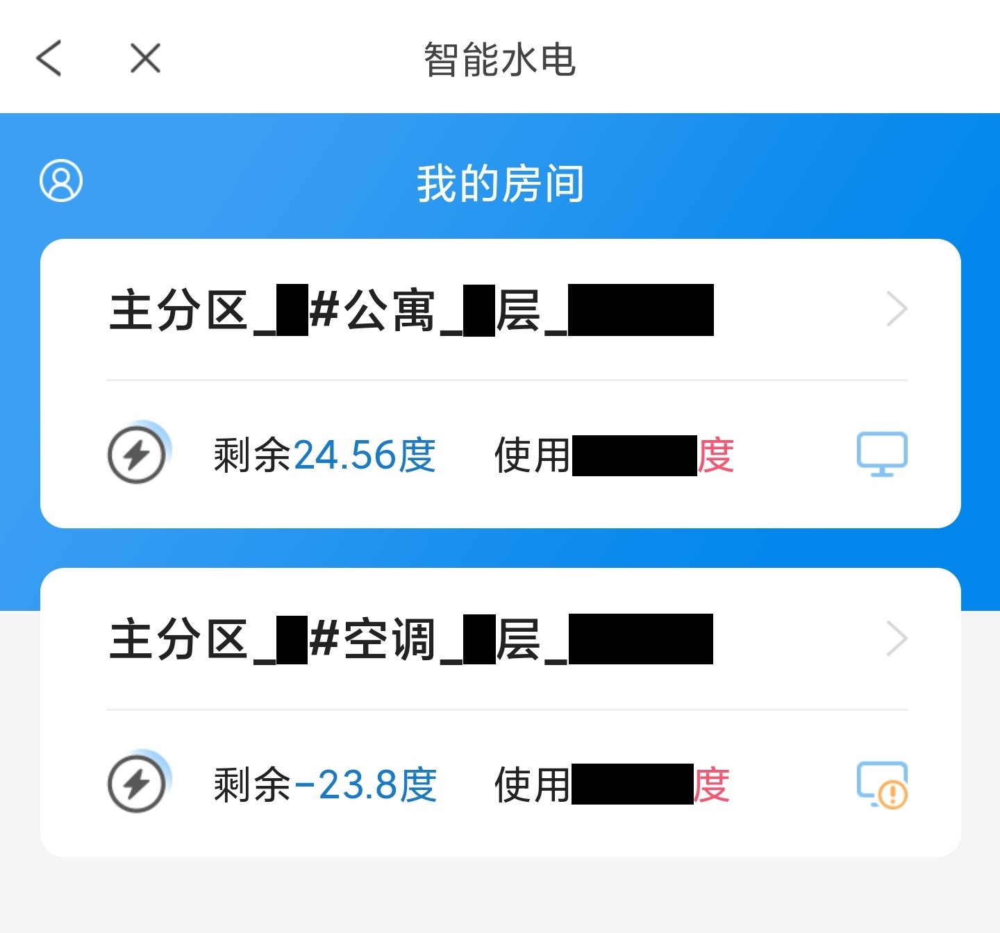

# 完美校园 低电费提醒🔔 

你是否曾经因为忘记检查电费，而遭遇晚上断电，还恰好处于充值系统的维护时间？ /(ㄒoㄒ)/~~  
于是，为了避免悲剧再次发生，这个**使用 Github Action** 定时执行、借助 [Qmsg 酱](https://qmsg.zendee.cn/)发送低电费提醒的 **shell 脚本**就诞生了！ （好耶ヽ(✿ﾟ▽ﾟ)ノ

## 工作原理

- 本脚本默认在每天 12 点和 19 点，自动查询在完美校园上所绑定的所有房间或空调的剩余度数，若低于设定的阈值，就通过 Qmsg 酱向指定 QQ 推送消息。

## 开始使用

  1. Fork 本仓库到自己的名下
  2. 打开新 Fork 的仓库主页，依次进入👉 `Settings` → `Secrets and variables` → `Actions`
  3. 点击右侧绿色按钮 `New repository secret`，按照下表依次填入 Name 和 Secret

      | Name       | Secret |
      | ---------- | ------ |
      | QMSG_KEY   | [点我登录 Qmsg 酱控制台](https://qmsg.zendee.cn/user)，找到并填入「我的KEY」。选择并主动添加可用的 Qmsg 酱的QQ好友，即可接收到 bot 的消息推送。|
      | ALERT_QQ   | 填入你的 QQ 号或群号 |
      | SCHOOL_ID  | 填入你所在学校的编码👉 [点我查看学校编码](./school-list.md) |
      | STUDENT_ID | 填入你的学号 |

  4. 添加完上述 secret 后，再点击绿色按钮 `New repository secret` 左边的 `Variables` 选项卡，然后点击右侧绿色按钮 `New repository variable`，按照下表依次填入 Name 和 Value

      | Name            | Value |
      | --------------- | ----- |
      | ALERT_THRESHOLD | 填入你想要设置的提醒阈值，单位是度，例如：15 |
      | IS_GROUP        | 上面的`ALERT_QQ`是否为群聊，是填`1`，不是填`0` |

  6. 回到仓库主页，依次进入👉 `Actions` → `完美校园低电费提醒`，点击右侧 `Run workflow` 可手动立即运行一次。若暂时不需要提醒，可在该页面的 `Filter workflow runs` 搜索框右边的 `···` 按钮中选择 `Disable workflow`，暂时禁用这个 workflow

## 注意事项

  1. 完美校园的智能水电偶尔会抽风，表现为手机 APP 无法进入相关页面，同时本脚本也无法查询相关信息。
  
  2. 本脚本消息推送功能使用的是[公共版 Qmsg 酱](https://qmsg.zendee.cn/docs/start/#%E5%85%AC%E5%85%B1%E7%89%88-%E6%8D%90%E8%B5%A0%E7%89%88-plus%E7%89%88-%E5%B7%AE%E5%BC%82)，消息推送数量上限为30条/天。
  
  3. 若需修改定时执行频率或时间段，请修改文件 [.github/workflows/backup.yml](./.github/workflows/main.yml) 第 4 行 `cron` 引号内的 [cron 表达式](https://zhuanlan.zhihu.com/p/437328366)。
  
  4. 桂电北海校区经[测试](https://github.com/zuwei522/perfect-campus_electricity-alert/actions/runs/5976106345/job/16213315269)可正常使用，其他学校暂不清楚能不能用。可在本仓库的 [Discussions](https://github.com/zuwei522/perfect-campus_electricity-alert/discussions/categories/%E5%90%84%E5%AD%A6%E6%A0%A1%E5%8F%AF%E7%94%A8%E6%80%A7%E5%88%86%E4%BA%AB) 分享你的或查看他人的测试结果。

      | Qmsg 推送消息 | 完美校园智能水电查询截图 |
      |:-:|:-:|
      |  |  |

## 如果觉得不错，可以点个⭐Star 吗？

